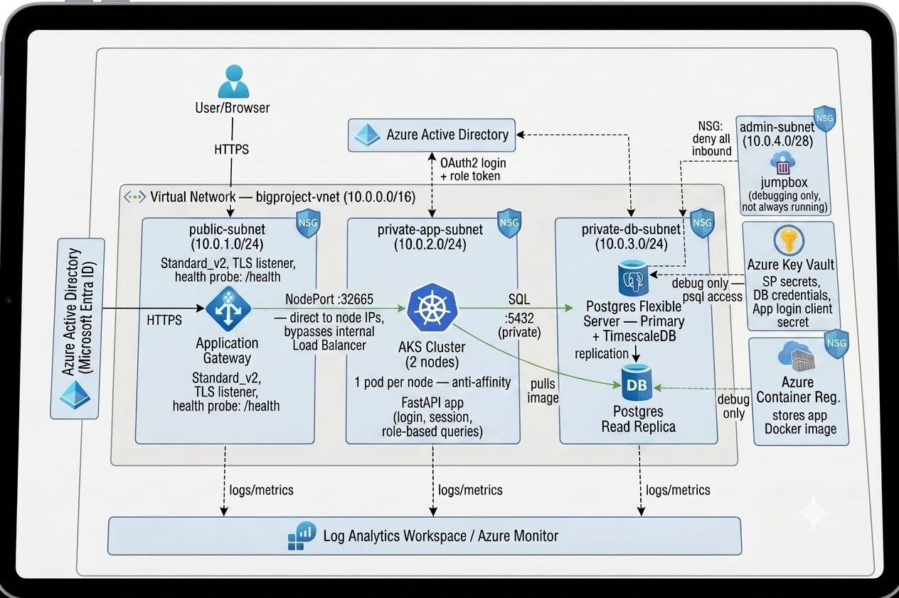

# BigProject — Azure Cloud Infrastructure

A production-shaped, end-to-end cloud infrastructure project on Microsoft
Azure: private networking, managed Kubernetes, a time-series-capable
database, TLS-terminated ingress, real user authentication with
role-based access control, and centralized observability — all defined as
code with [Pulumi](https://www.pulumi.com/) (Python).

This is the Azure-native counterpart to an earlier AWS/Terraform reference
architecture, re-designed around Azure's own service catalog rather than a
direct port.

## Architecture



**Request flow:**

```
Browser
  │  HTTPS
  ▼
Application Gateway (public subnet, TLS, health-probed)
  │  routes directly to AKS node private IPs on a fixed NodePort
  ▼
AKS  (2-node cluster, private subnet)
  │  /login → Azure AD (Microsoft Entra) sign-in
  │  /auth/callback → session cookie with user's role (Admin / Viewer)
  ▼
Azure Database for PostgreSQL  (private subnet, primary + read replica)
  + TimescaleDB extension for time-series sensor data

Postgres, AKS, and Application Gateway all send diagnostics to a shared
Azure Monitor / Log Analytics Workspace.
```

## What this demonstrates

- **Network isolation** — a VNet with public/private subnet segmentation
  and per-subnet Network Security Groups enforcing least-privilege traffic
  flow between tiers
- **Least-privilege infrastructure identity** — deploy permissions built
  incrementally as custom RBAC roles, one per resource type, rather than
  broad Contributor access
- **Managed data with a real extension** — Postgres Flexible Server with a
  read replica and the TimescaleDB extension for time-series workloads
- **Kubernetes in production shape** — AKS with pod anti-affinity across
  nodes, health probes, and a deliberate ingress architecture chosen after
  diagnosing and resolving a real cross-subnet load balancer issue
- **Real authentication** — Azure AD (Microsoft Entra) login via OAuth2,
  with App Roles driving role-based data access in the application itself
- **Centralized observability** — Log Analytics receiving diagnostics from
  the database, cluster, and ingress layer
- **Infrastructure as code, fully reproducible** — two independently
  deployable Pulumi stacks (bootstrap and application), documented well
  enough to rebuild the entire environment from nothing using only these
  READMEs — verified via multiple real, blind rebuilds

## Repository layout

```
.
├── SetUp/              Bootstrap stack: resource group, identities, RBAC roles,
│                       Key Vault, Azure AD App Registration for user login
├── Deploy/             Application stack: network, database, AKS, ingress,
│                       monitoring
│   ├── app/            The demo application (FastAPI) deployed to AKS
│   └── k8s/             Kubernetes manifests
├── diagram.jpg         Architecture diagram
└── README.md           This file
```

Each directory has its own detailed README with prerequisites, exact
deployment commands, and known operational gotchas encountered while
building this out — start there for hands-on setup.

## Technology stack

| Category | Technology |
|---|---|
| Infrastructure as Code | Pulumi (Python) |
| Cloud provider | Microsoft Azure |
| Compute | Azure Kubernetes Service (AKS) |
| Database | Azure Database for PostgreSQL Flexible Server + TimescaleDB |
| Container registry | Azure Container Registry |
| Ingress / load balancing | Azure Application Gateway (Standard_v2) |
| Identity (infrastructure) | Azure AD Service Principals, custom RBAC roles |
| Identity (application) | Azure AD (Microsoft Entra ID) OAuth2 login, App Roles |
| Secrets | Azure Key Vault |
| Observability | Azure Monitor / Log Analytics |
| Application | FastAPI (Python), `msal`, `psycopg2` |

## Getting started

Deployment requires two stacks, applied in order, plus a manual application
image build and a Kubernetes deployment step. Each has its own detailed,
step-by-step guide:

1. **[`SetUp/README.md`](./SetUp/README.md)** — bootstrap: resource group,
   identities, RBAC, Key Vault, Azure AD App Registration
2. **[`Deploy/README.md`](./Deploy/README.md)** — application
   infrastructure: network, database, AKS, ingress with TLS, monitoring,
   and the full application deployment and verification steps

**Prerequisites**, common to both: [Pulumi CLI](https://www.pulumi.com/docs/install/),
[Azure CLI](https://learn.microsoft.com/en-us/cli/azure/install-azure-cli),
`kubectl`, `docker`, `openssl`, Python 3.12+, and an authenticated `az login`
session against an Azure subscription.

**Quick orientation** if you just want the shape of it:

```bash
cd SetUp && pulumi up      # identities, RBAC, Key Vault, AD login registration
cd ../Deploy && pulumi up  # network, database, AKS, ingress, monitoring
# build + push the application image, create Kubernetes secrets,
# deploy the app — see Deploy/README.md for exact commands
```

Full provisioning of both stacks typically takes 25–35 minutes.

## Cost

This project targets a pay-as-you-go Azure subscription with no assumed
trial credit. The largest ongoing costs are Postgres (primary + replica,
GeneralPurpose tier), AKS nodes, and Application Gateway. Both README files
include `pulumi destroy` as the documented end-of-session step — the
environment is designed to be torn down and rebuilt on demand rather than
left running.

## Notable engineering decisions

A few choices worth calling out, documented in more depth in the relevant
subdirectory README:

- **AKS over Azure Container Apps** for the compute layer — chosen partway
  through the build to better reflect production Kubernetes practice,
  including explicit control over scheduling behavior (pod anti-affinity)
  and networking.
- **Application Gateway targets AKS nodes directly on a fixed NodePort**,
  bypassing the AKS-managed internal Load Balancer — a deliberate
  architectural decision made after isolating a real, reproducible issue
  where that Load Balancer's Direct Server Return configuration did not
  reliably serve Application Gateway's cross-subnet traffic. See
  `Deploy/README.md` → "Ingress design" for the full diagnostic path.
- **Custom RBAC roles built incrementally**, one per Azure resource type,
  rather than a single broad Contributor grant for the deploying identity —
  mirrors least-privilege patterns used in production environments.
- **Two independent Pulumi stacks** (`SetUp/`, `Deploy/`) rather than one
  monolithic stack, so foundational identity/secrets infrastructure can
  persist (or be safely destroyed) independently of the more expensive,
  frequently-iterated application infrastructure.

## License

This is a personal portfolio / learning project. No license is implied for
production use.
